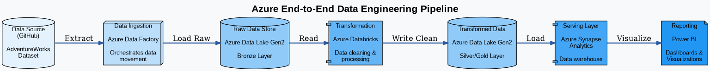

# 🚀 Azure End-to-End Data Engineering Project


## 📋 Project Overview

This project demonstrates a complete end-to-end data engineering pipeline built on Microsoft Azure. It ingests raw data from GitHub, processes it through various Azure services, and delivers insights through interactive Power BI dashboards.

The project uses the **AdventureWorks dataset** from Kaggle to showcase real-world data engineering practices including data ingestion, transformation, storage, and visualization.

## 🏗️ Architecture



### Pipeline Flow:

1. **Data Source** → GitHub (AdventureWorks Dataset)
2. **Data Ingestion** → Azure Data Factory
3. **Raw Storage** → Azure Data Lake Gen2 (Bronze Layer)
4. **Transformation** → Azure Databricks
5. **Processed Storage** → Azure Data Lake Gen2 (Silver Layer)
6. **Serving Layer** → Azure Synapse Analytics(Gold Layer)
7. **Visualization** → Power BI

## 🛠️ Technologies Used

| Component | Technology | Purpose |
|-----------|-----------|---------|
| **Data Source** | GitHub/Kaggle | Raw data storage |
| **Orchestration** | Azure Data Factory | Pipeline automation & data movement |
| **Raw Storage** | Azure Data Lake Gen2 | Scalable data lake (Bronze layer) |
| **Processing** | Azure Databricks | Data transformation & cleaning |
| **Processed Storage** | Azure Data Lake Gen2 | Curated data (Silver/Gold layers) |
| **Data Warehouse** | Azure Synapse Analytics | Analytical data serving |
| **Visualization** | Power BI | Interactive dashboards & reports |

## 📊 Data Layers

### Bronze Layer (Raw Data)
- Raw data ingested from source without transformations
- Maintains original format and structure
- Stored in Azure Data Lake Gen2

### Silver Layer (Cleaned Data)
- Data cleaned and validated
- Schema standardization
- Data type corrections
- Duplicate removal

### Gold Layer (Business-Ready)
- Aggregated and optimized for reporting
- Business logic applied
- Ready for consumption by end users

## 🚦 Getting Started

### Prerequisites

- Azure subscription
- Azure Data Factory workspace
- Azure Databricks workspace
- Azure Data Lake Gen2 storage account
- Azure Synapse Analytics workspace
- Power BI account

### Setup Steps

1. **Clone the Repository**
   ```bash
   git clone https://github.com/yourusername/azure-data-engineering-project.git
   cd azure-data-engineering-project
   ```

2. **Configure Azure Resources**
   - Create Azure Data Factory instance
   - Set up Azure Data Lake Gen2 storage
   - Deploy Azure Databricks workspace
   - Configure Azure Synapse Analytics

3. **Set Up Data Factory Pipeline**
   - Create linked services for data sources
   - Configure datasets
   - Build and schedule pipelines

4. **Configure Databricks**
   - Create compute clusters
   - Import transformation notebooks
   - Set up mount points to Data Lake

5. **Set Up Synapse Analytics**
   - Create dedicated SQL pools
   - Define external tables
   - Build views for reporting

6. **Connect Power BI**
   - Connect to Synapse Analytics
   - Create data models
   - Build interactive dashboards

## 📁 Project Structure

```
azure-data-engineering-project/
├── data-factory/
│   ├── pipelines/
│   └── linked-services/
├── databricks/
│   ├── notebooks/
│   │   ├── bronze-to-silver.py
│   │   └── silver-to-gold.py
│   └── configs/
├── synapse/
│   ├── sql-scripts/
│   └── views/
├── powerbi/
│   └── reports/
└── README.md
```

## 🔄 Pipeline Workflow

### 1. Data Ingestion
Azure Data Factory connects to GitHub and extracts the AdventureWorks dataset using HTTP connectors.

### 2. Raw Data Storage
Data is loaded into Azure Data Lake Gen2 (Bronze layer) in its original format for auditing and reprocessing.

### 3. Data Transformation
Azure Databricks processes the data:
- Cleans and validates data quality
- Handles missing values
- Standardizes formats
- Applies business rules

### 4. Curated Data Storage
Processed data is stored back in Data Lake Gen2:
- Silver layer: Cleaned and validated data
- Gold layer: Business-ready aggregated data

### 5. Data Warehouse Loading
Azure Synapse Analytics loads the gold layer data for optimized querying and analysis.

### 6. Reporting & Visualization
Power BI connects to Synapse to create interactive dashboards for business insights.

## 🎯 Key Features

- ✅ **Automated Data Pipeline**: Scheduled data ingestion and processing
- ✅ **Scalable Architecture**: Handles growing data volumes efficiently
- ✅ **Data Quality**: Built-in validation and cleansing
- ✅ **Cost-Effective**: Uses Azure's pay-as-you-go model
- ✅ **Real-time Insights**: Power BI dashboards with auto-refresh
- ✅ **Medallion Architecture**: Bronze, Silver, Gold data layers

## 📈 Sample Insights

The Power BI dashboard provides insights on:
- Sales performance by region
- Product category analysis
- Customer segmentation
- Inventory management
- Revenue trends
